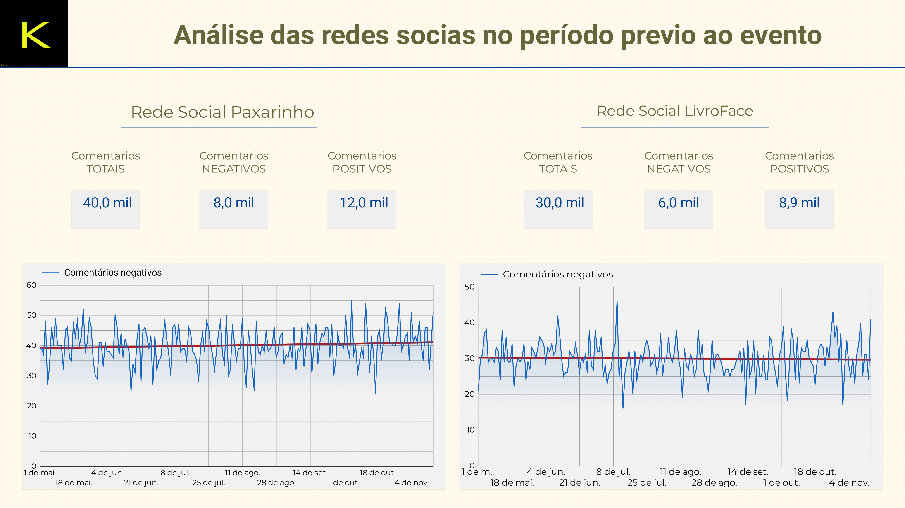
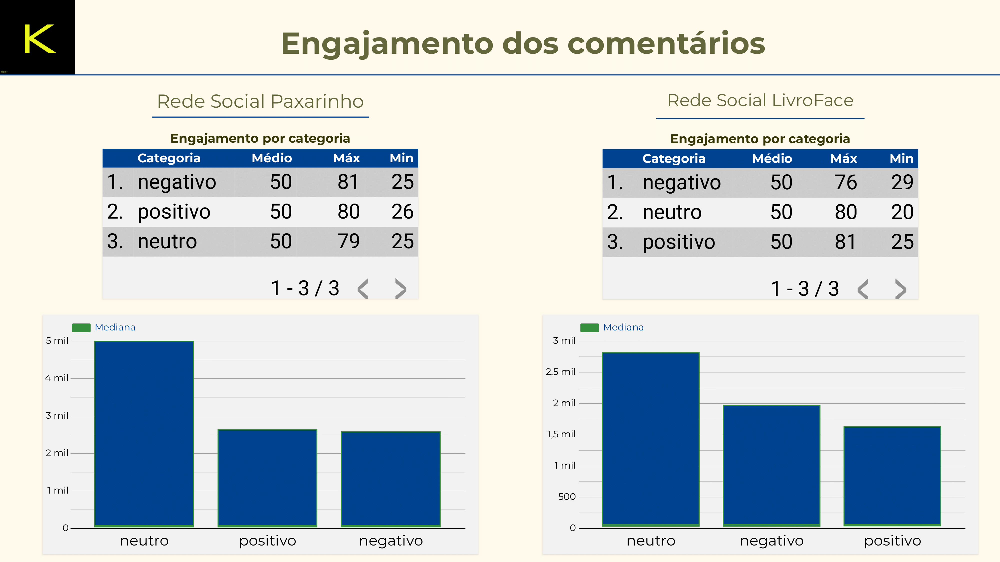
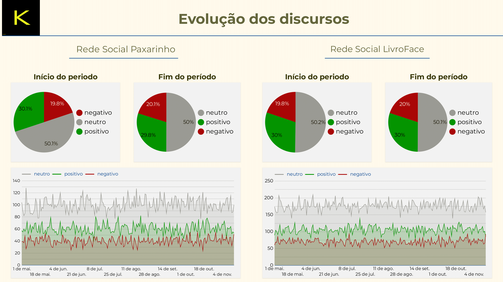
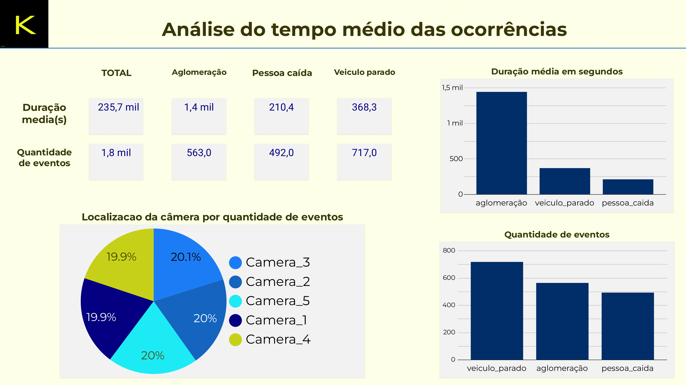
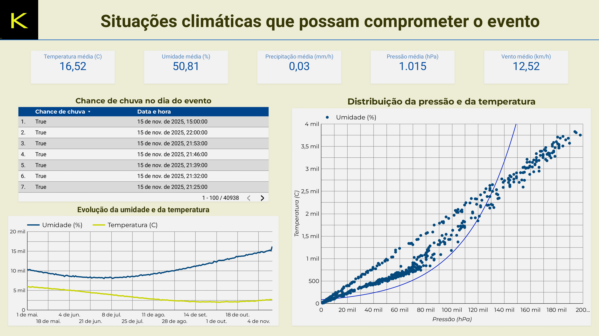
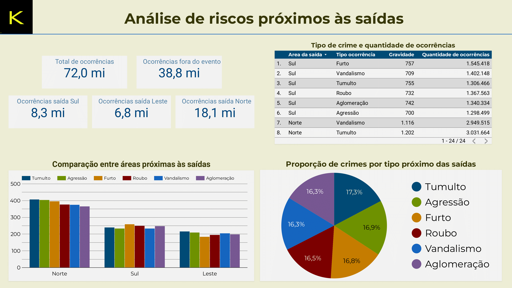
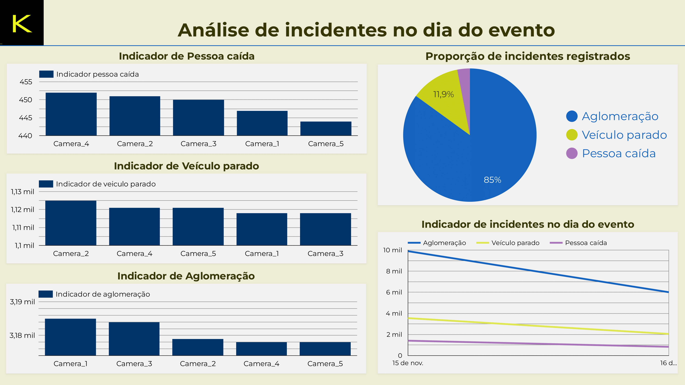
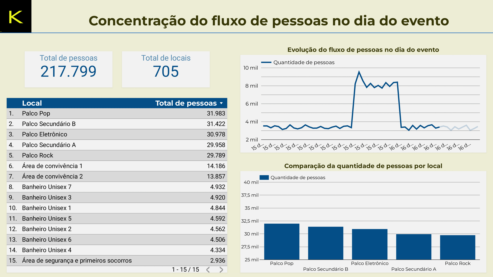

<strong>📍 Sobre</strong>

O **Echo Music** é um projeto de análise de dados para antecipação de riscos em eventos públicos de grande porte. Utiliza dados sintéticos inspirados em fontes reais para detectar padrões associados a tumultos, crimes e situações de emergência. A proposta é contribuir com estratégias de prevenção em eventos como shows, festivais e grandes manifestações, por meio da análise de dados em tempo real.

<strong>🚨 O problema</strong>

# **Problema e a justificativa do uso de dados.**

## Descrição detalhada do problema:

Grandes eventos públicos, como manifestações políticas, shows, jogos esportivos e festivais culturais, reúnem milhares ou até milhões de pessoas em um único local. Apesar da importância social e cultural desses eventos, eles também apresentam riscos elevados de tumultos, atos de violência, vandalismo e até ataques terroristas. A dificuldade está em monitorar, em tempo real, o comportamento de grandes multidões e antecipar situações que possam evoluir para crises de segurança.  
Além disso, a resposta das forças de segurança costuma ser reativa, ou seja, ocorre depois que o problema já se instalou, o que dificulta a contenção e aumenta os riscos para a população e para a infraestrutura local.

---

Eficiência do uso de análise de dados

* Estudos apontam que o uso de modelos preditivos e monitoramento em tempo real reduz em até 40% o tempo de resposta a incidentes em grandes eventos (fonte: International Association of Venue Managers).  
* A utilização de análise de sentimentos em redes sociais pode antecipar mobilizações ou comportamentos de risco com até 3 horas de antecedência (fonte: MIT Media Lab).

---

## Conclusão

Este projeto é altamente relevante porque:

* Atua preventivamente, não apenas de forma reativa.  
* Reduz riscos para meio milhão de pessoas em um único evento.  
* Pode ser replicado para outros eventos em larga escala no Brasil e no mundo.  
* Fortalece a confiança social na realização de eventos públicos seguros, estimulando a participação cidadã.

## Exemplo real:

Tentativa de atentado no show gratuito de Lady Gaga em Copacabana (2025).  
Em 3 de maio de 2025, Lady Gaga realizou um show gratuito na Praia de Copacabana, no Rio de Janeiro, que atraiu mais de 2 milhões de pessoas, tornando-se o maior evento da carreira da artista.  
Durante o evento, as autoridades brasileiras impediram um plano de ataque com coquetéis molotov e outros explosivos improvisados, que visava especificamente o público LGBTQIA+ e crianças. A operação de segurança, denominada "Operação Fake Monster", foi conduzida de forma sigilosa para evitar pânico entre os participantes. [BBC](https://www.bbc.com/portuguese/articles/c1drv6ey6gxo?utm_source=chatgpt.com)  
As investigações revelaram que o grupo responsável pelo plano disseminava discursos de ódio online e recrutava adolescentes para realizar os ataques. A polícia identificou e prendeu um homem no Rio Grande do Sul por posse ilegal de armas e um adolescente no Rio de Janeiro por posse de material pornográfico infantil.  
Como a análise de dados ajudou?  
A análise de dados desempenhou um papel fundamental na prevenção desse atentado:  
Monitoramento de redes sociais: As autoridades monitoraram ativamente redes sociais e aplicativos de mensagens para identificar postagens suspeitas e coordenar ações preventivas.  
Análise de padrões de comportamento: Através da análise de dados, foi possível identificar padrões de comportamento que indicavam a preparação de um ataque, permitindo uma resposta rápida e eficaz.  
Integração de informações: A colaboração entre diferentes agências de segurança e o uso compartilhado de dados foram essenciais para desarticular o plano de ataque de forma coordenada.

Graças a essas estratégias baseadas em dados, o evento transcorreu sem incidentes graves, garantindo a segurança do público e o sucesso do show.   

<strong>🔍 Fontes de dados e coleta</strong>

# **Fontes de dados levantadas e o método de coleta**

## **Fontes de Dados Prioritárias para o Projeto**

### **1\. Redes Sociais** (Twitter/X, Instagram, Facebook, TikTok)

**Descrição:**  
Plataformas onde usuários publicam conteúdos em tempo real sobre eventos, incluindo textos, imagens, vídeos e localização.  
**Tipo de dados:**  
Não estruturados: textos, imagens, vídeos.  
Semi-estruturados: posts com metadados (data, hora, localização geográfica, hashtags).  
**Métodos de acesso e coleta:**

* API Oficial:  
  Twitter/X API: permite acesso a tweets públicos em tempo real, com filtros por    palavras-chave, hashtags ou geolocalização.  
  Meta Graph API: para publicações públicas no Instagram e Facebook.  
  TikTok: não possui API pública oficial para coleta em massa; pode ser necessário       usar scraping com cautela.  
* Web Scraping:  
  Para dados públicos visíveis na web, com atenção às políticas de uso das plataformas.  
* Ferramentas especializadas:  
  GNIP (para Twitter), CrowdTangle (para Facebook/Instagram).  
  ---

### **2\. Câmeras Públicas de Monitoramento** (CCTV Online)

**Descrição:**  
Algumas cidades oferecem acesso público a câmeras de monitoramento de tráfego e espaços públicos.  
**Tipo de dados:**  
Não estruturados: vídeo em tempo real ou imagens.  
**Métodos de acesso e coleta:**

* Streams públicos: Sites de prefeituras ou órgãos de trânsito que disponibilizam câmeras online.  
* Web scraping: Extração de imagens ou fluxos, com cuidado legal.  
* Integração direta: Via acordos com prefeituras ou órgãos de segurança que disponibilizem feeds abertos.

---

### **3\. Dados de Transporte Público** (GTFS e APIs de mobilidade)

**Descrição:**  
Informações sobre fluxo de transporte público (metrô, ônibus), úteis para entender concentração e deslocamento de pessoas.  
**Tipo de dados:**  
Estruturados: horários, rotas, número de passageiros.  
**Métodos de acesso e coleta:**

* GTFS (General Transit Feed Specification): Formato padrão usado mundialmente para disponibilização de dados de transporte.  
* APIs locais: exemplos: SPTrans (São Paulo), Moovit API, Google Transit API.  
* Scraping: Para casos em que os dados são publicados em sites sem API.

---

### **4\. Dados Meteorológicos** (INMET, NOAA, OpenWeather)

**Descrição:**  
Condições climáticas podem impactar a segurança em eventos (tempestades, calor extremo).  
**Tipo de dados:**  
Estruturados: temperatura, umidade, pressão, previsão do tempo, histórico.  
**Métodos de acesso e coleta:**

* APIs públicas:  
  OpenWeather API (grátis para consultas básicas).  
  NOAA (National Oceanic and Atmospheric Administration) — dados climáticos históricos e em tempo real.  
  INMET (Instituto Nacional de Meteorologia — Brasil) — dados meteorológicos públicos

---

### **5\. Dados Históricos de Crimes e Ocorrências Policiais**

**Descrição:**  
Bases de dados públicas sobre crimes, incidentes e ocorrências relacionadas a eventos anteriores.  
**Tipo de dados:**  
Estruturados: tabelas com localização, tipo de ocorrência, data e hora.  
**Métodos de acesso e coleta:**

* Portais de dados abertos: ex.: SSP-SP (Secretaria de Segurança Pública de São Paulo), FBI Crime Data Explorer (EUA).  
* Downloads diretos: CSV, Excel ou JSON.

---

### **6\. Sensores Urbanos e Dados de Ruído** (Plataformas Open Data)

**Descrição:** 
Sensores instalados em cidades inteligentes coletam dados sobre níveis de ruído, poluição e densidade de pessoas. **Tipo de dados:** Estruturados: níveis de decibéis, fluxo de pessoas. **Métodos de acesso e coleta:**
**Métodos de acesso e coleta:**

* Plataformas Open Data: exemplos: NYC Open Data, Dados Abertos SP.
* APIs de sensores urbanos: Smart Cities com sistemas de dados abertos podem oferecer esse recurso.

---

### **7\. Mapas e localização:** 

**Descrição:**
Dados de localização e mapas (OpenStreetMap): importantes para a visualização geoespacial e roteamento, mas não essenciais para a detecção direta de tumultos.
**Métodos de coleta:**
Os dados foram criados com ferramentas e bibliotecas generativas. 

## Justificativa do uso de dados sintéticos:

Devido à natureza sensível dos dados envolvidos neste tipo de análise — incluindo informações pessoais, geolocalização e conteúdos potencialmente identificáveis de redes sociais —, este projeto opta pela utilização de **dados sintéticos**.

Os dados sintéticos são informações geradas artificialmente que imitam características estatísticas e padrões encontrados em dados reais, mas sem representar indivíduos ou eventos reais. Esta abordagem oferece diversas vantagens:

1. Evita riscos legais e éticos, respeitando legislações como a LGPD (Lei Geral de Proteção de Dados).

2. Permite o desenvolvimento e validação de modelos analíticos em um ambiente seguro e controlado.

3. Favorece a transparência e a replicabilidade, uma vez que os dados podem ser compartilhados livremente para fins educacionais ou de pesquisa.

Assim, o uso de dados sintéticos neste projeto não compromete a validade da proposta, pois o foco está na demonstração da metodologia e no potencial da análise de dados como ferramenta para prevenção de crises em eventos de grande porte.

# Acesso aos notebooks

- [Tabelas_Redes_Collab.ipynb](https://github.com/gabianalista/Echo_Music/blob/main/Tabelas_Redes_Collab.ipynb)  
- [Tabelas_Câmeras_Collab.ipynb](https://github.com/gabianalista/Echo_Music/blob/main/Tabelas_Câmeras_Collab.ipynb)  
- [Tabela_transporte_Collab.ipynb](https://github.com/gabianalista/Echo_Music/blob/main/Tabela_transporte_Collab.ipynb)  
- [Tabela_Meteorologia_Collab.ipynb](https://github.com/gabianalista/Echo_Music/blob/main/Tabela_Meteorologia_Collab.ipynb)  
- [Tabela_Historico_Collab.ipynb](https://github.com/gabianalista/Echo_Music/blob/main/Tabela_Historico_Collab.ipynb)  
- [Tabela_Sensores_Collab.ipynb](https://github.com/gabianalista/Echo_Music/blob/main/Tabela_Sensores_Collab.ipynb)  
- [Tabela_Mapas_Collab.ipynb](https://github.com/gabianalista/Echo_Music/blob/main/Tabela_Mapas_Collab.ipynb)

<strong>📊 Insights</strong>

# Tabelas

<strong>1. Redes sociais</strong>
 
  
[Ver insight detalhado](https://github.com/Gaby-Kern/Echo_Music/blob/main/Insight%20-%20Redes%20Sociais.md)

**Insight:**  
A análise evidencia que, ao longo do período monitorado, os discursos neutros predominaram, tanto em volume quanto em engajamento, enquanto os discursos negativos permaneceram como minoria. No entanto, identificou-se um pequeno, mas consistente aumento na quantidade de comentários negativos, especialmente nos dois meses que antecederam o evento.  
Esse crescimento foi mais expressivo na rede social Paxarinho, indicando a necessidade de um monitoramento mais intenso e direcionado nesta plataforma.  
Apesar do maior volume de engajamento estar associado aos comentários neutros, a mediana de reações é proporcional entre os três tipos de discurso, revelando que comentários negativos, embora menos frequentes, também têm potencial significativo de engajamento.  
Esse padrão reforça a importância de manter um monitoramento ativo e contínuo, pois discursos negativos, mesmo que minoritários, podem alcançar uma ampla disseminação e gerar impactos relevantes na dinâmica social das plataformas analisadas.  

**Dashboards:**  
 
 

<strong>2. Câmeras públicas</strong>
 

[Ver insight detalhado](https://github.com/Gaby-Kern/Echo_Music/blob/main/Insight%20-%20Câmeras%20Publicas.md)

**Insight:**  
A análise evidencia que, apesar de aglomerações durarem mais, o volume de ocorrências de veículos parados é superior. Esse padrão sugere que diferentes tipos de eventos requerem abordagens distintas:  
Aglomerações podem demandar maior tempo de resposta e estratégias para redução de permanência.  
Veículos parados, apesar de rápidos, são numerosos e podem indicar problemas de mobilidade ou risco potencial.  
A distribuição equilibrada entre as câmeras reforça a necessidade de manter a vigilância de forma ampla e contínua, sem priorizar exclusivamente um ponto específico. 

**Dashboard:**  

<strong>3. Transporte público</strong>
 

[Ver insight detalhado](https://github.com/Gaby-Kern/Echo_Music/blob/main/Insight%20-%20Transporte%20Público.md)

**Insight:**  
Com base na Análise de Rotas Alternativas, conseguimos identificar padrões importantes para a tomada de decisão sobre mobilidade urbana.  
As linhas de metrô demonstraram maior eficiência em termos de tempo médio de viagem, sendo mais rápidas que as linhas de ônibus.  
Apesar da eficiência, o metrô também apresentou uma lotação estimada superior tanto no sentido de ida quanto na volta, indicando uma maior demanda nesse tipo de transporte.  
Em relação aos status das linhas, os dados mostram que o metrô apresenta menos problemas operacionais (como interrupções ou atrasos) do que as linhas de ônibus, reforçando sua confiabilidade como alternativa.  
Contudo, ao analisarmos a proporção de status problemáticos (gráfico de pizza), percebemos que as linhas possuem uma distribuição uniforme de cerca de 20% de ocorrências problemáticas, independentemente do tipo de transporte.  

**Dashboard:**  

<strong>4. Meteorologia</strong>
 

[Ver insight detalhado](https://github.com/Gaby-Kern/Echo_Music/blob/main/Insight%20-%20Meteorologia.md)

**Insight:**  
A análise meteorológica revelou tendências importantes que podem impactar diretamente na segurança e no planejamento do evento.   
A elevação da umidade e a queda de temperatura indicam potencial aumento de chuvas, embora a pressão atmosférica permaneça estável, reduzindo o risco imediato de tempestades severas.  
Esses dados são cruciais para a tomada de decisões preventivas, como ajustes no cronograma, preparação de áreas cobertas, reforço de sinalizações de segurança e orientações específicas ao público sobre vestimentas adequadas e hidratação.  
Dessa forma, a análise meteorológica transforma-se em uma ferramenta estratégica para garantir a continuidade, segurança e conforto durante o evento.

**Dashboard:**  

<strong>5. Histórico de crimes</strong>
 

[Ver insight detalhado](https://github.com/Gaby-Kern/Echo_Music/blob/main/Insight%20-%20Histórico%20de%20crimes.md)

**Insight:**  
A análise indicou que o volume de crimes permaneceu estável ao longo do período avaliado, com uma média diária entre 60 e 61 ocorrências, sem picos ou quedas significativas. Esse comportamento sugere que o risco de crimes é contínuo e não concentrado em horários específicos, o que exige uma vigilância constante durante todo o evento. Observou-se uma concentração significativa de crimes na área próxima à saída Norte, que registrou cerca de 400 ocorrências, enquanto as saídas Sul e Leste apresentaram números bem menores, entre 200 e 250\. Esse dado evidencia uma vulnerabilidade maior na saída Norte, possivelmente relacionada ao maior fluxo de pessoas ou à configuração física dessa área. Em relação aos tipos de crime, a distribuição foi relativamente equilibrada entre as categorias, com destaque discreto para “Tumulto”, que apresentou uma participação levemente superior, mas ainda próxima de 16% para cada tipo. Esse padrão indica que não há um tipo de crime predominante, o que reforça a necessidade de abordagens de segurança abrangentes, e não focadas exclusivamente em determinados comportamentos.  
Diante desses resultados, recomenda-se reforçar a segurança na saída Norte, com mais agentes e monitoramento, além de manter medidas preventivas nas demais saídas. A adoção de barreiras físicas, sinalização adequada e sistemas de monitoramento em tempo real pode ajudar a reduzir riscos, melhorar o controle do fluxo e minimizar a ocorrência de novos incidentes.

**Dashboard:**  

<strong>6. Sensores urbanos</strong>
 

[Ver insight detalhado](https://github.com/Gaby-Kern/Echo_Music/blob/main/Insight%20-%20Sensores%20Urbanos.md)

**Insight:**  
Os dados indicam que o principal desafio na gestão das áreas monitoradas é o controle de aglomerações, especialmente em pontos específicos como as câmeras 1 e 3\. Recomenda-se reforçar medidas de segurança e controle de fluxo nesses locais, como presença de agentes de monitoramento e sinalização preventiva. A tendência de queda nas aglomerações ao longo do tempo pode indicar a eficácia de ações já implementadas, mas recomenda-se manter a vigilância, principalmente em horários ou eventos de maior movimento. Dado o baixo volume de registros de veículos parados e pessoas caídas, esses incidentes podem ser tratados com protocolos de resposta padrão, sem necessidade imediata de alocação adicional de recursos. Por fim, sugere-se o uso contínuo de ferramentas de análise automatizada para identificar rapidamente alterações nos padrões de movimentação e antecipar riscos, garantindo segurança e fluidez no ambiente monitorado. 

**Dashboard:**  

<strong>7. Mapas e localização</strong>
 

[Ver insight detalhado](https://github.com/Gaby-Kern/Echo_Music/blob/main/Insight%20-%20Mapas%20e%20Localização.md)

**Insight:**  
A análise evidencia que os palcos principais atraíram o maior público, demandando maior atenção em termos de segurança, infraestrutura e fluxo de pessoas nesses locais. Os picos de concentração registrados à noite indicam a necessidade de reforço de equipes e controles neste período para evitar superlotação e garantir a segurança do público. Recomenda-se também melhorar a sinalização e o acesso às áreas de convivência e banheiros, que, apesar de terem menor fluxo, são essenciais para o conforto e bem-estar dos participantes. Monitoramento contínuo e planejamento estratégico baseado nesses dados podem otimizar a gestão do evento e a experiência dos visitantes. 

**Dashboard:**  

